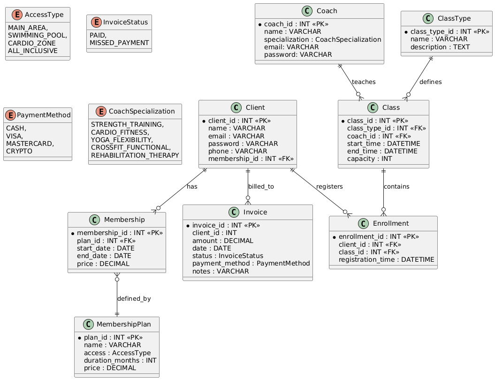

# Lab 1
## 1. Вимоги для системи

### Вимоги до функціональності для клієнта

*  Система повинна надавати можливість реєстрації клієнта з обов’язковим зазначенням імені, email та телефону.
*  Система повинна дозволяти клієнту переглядати доступні плани членства (абонементи) та обирати із них.
*  Клієнт має мати можливість переглядати свої активні членства та закривати їх.
*  Клієнт повинен мати можливість переглядати розклад групових занять, інформацію про тренера та тип заняття.
*  Система повинна дозволяти клієнту записуватися на доступні заняття, якщо є вільні місця.
*  Система повинна надавати клієнту доступ до його записів на заняття.
*  Клієнт повинен мати можливість переглядати свої рахунки-фактури (інвойси) та їх статус оплати.

---

### Вимоги до функціональності для тренера

*  Система повинна забезпечувати можливість реєстрації тренера з зазначенням спеціалізації.
*  Система повинна дозволяти тренеру переглядати свій розклад занять.
*  Тренер повинен мати доступ до списку клієнтів, які записані на його заняття.

---

### Вимоги до функціональності для адміністратора

*  Система повинна надавати повний доступ до всіх даних: клієнтів, тренерів, членств, занять, рахунків.
*  Адміністратор повинен мати можливість керувати даними клієнтів (реєстрація, редагування, видалення).
*  Система повинна дозволяти створювати, редагувати та видаляти плани членства (абонементи), вказуючи їх вартість, тривалість та рівень доступу.
*  Адміністратор повинен мати можливість керувати розкладом занять: створювати нові заняття, призначати тренерів, встановлювати час та місткість.
*  Система має забезпечувати функціонал для виставлення рахунків клієнтам та відстеження їх оплати.
*  Адміністратор повинен мати можливість керувати даними тренерів (додавання, зміна спеціалізації).

---

## 2. Дані для зберігання

### 2.1 Сутності та їх атрибути

Client (Клієнт)
* ID (client_id)
* Ім’я (name)
* Електронна пошта (email)
* Пароль (password)
* Телефон (phone)
* ID членства (membership_id) - зв'язок з абонементом

Membership (Членство / Абонемент)
* ID (membership_id)
* ID плану (plan_id) - зв'язок з планом членства
* Дата початку (start_date)
* Дата закінчення (end_date)
* Ціна (price)

MembershipPlan (План членства)
* ID (plan_id)
* Назва (name)
* Рівень доступу (access) - наприклад, тільки тренажерний зал, зал + басейн тощо.
* Тривалість у місяцях (duration_months)
* Ціна (price)

Invoice (Рахунок-фактура)
* ID (invoice_id)
* ID клієнта (client_id)
* Сума (amount)
* Дата (date)
* Статус (status) - наприклад, оплачено, прострочено.
* Метод оплати (payment_method) - готівка, картка тощо.
* Примітки (notes)

Coach (Тренер)
* ID (coach_id)
* Ім’я (name)
* Спеціалізація (specialization)
* Електронна пошта (email)
* Пароль (password)

ClassType (Тип заняття)
* ID (class_type_id)
* Назва (name) - наприклад, йога, бокс, кардіо.
* Опис (description)

Class (Заняття)
* ID (class_id)
* ID типу заняття (class_type_id)
* ID тренера (coach_id)
* Час початку (start_time)
* Час закінчення (end_time)
* Місткість (capacity) - максимальна кількість учасників.

Enrollment (Запис на заняття)
* ID (enrollment_id)
* ID клієнта (client_id)
* ID заняття (class_id)
* Час реєстрації (registration_time)

---

## 3. Бізнес-правила, припущення

* Один Тренер не може проводити два Заняття, які перетинаються за часом.

* У одного Тренера на день може бути не більше 6 Занять із мінімальною тривалістю 30 хв.

* Для кожного Заняття поле Тренера є обов'язковим.

* Клієнт не може записатися на одне і те ж Заняття двічі.

* Клієнт може мати не більше 7 Занять на тиждень.

* Поля Ім'я, Електронна пошта та Пароль для сутностей Клієнт та Тренер є обов'язковими при реєстрації.

* Поля email та phone у сутності Клієнт та поле email у сутності Тренер повинні бути унікальними в системі.

* Редагування часу (start_time, end_time) або місткості (capacity) Заняття, на яке вже є Записи на заняття, можливе лише з надсиланням повідомлення клієнтам, або неможливе менш ніж за 24 години до початку.

* Дата закінчення (end_date) Членства завжди повинна бути більшою за дату початку (start_date), і різниця має відповідати тривалості плану (duration_months) з Плану членства.

* Місткість (capacity) Заняття має бути більше 0 і менше за 10.

* Запис на заняття можливий лише на майбутні Заняття (де start_time Заняття більше, ніж поточний час), і лише до початку Заняття.

* Клієнт може записатися на заняття лише за наявності активного членства (абонемента).

* Запис на заняття неможливий, якщо досягнуто максимальної кількості учасників (capacity).

* Один тренер може проводити багато різних занять.

* Рахунки-фактури автоматично генеруються для клієнтів при оформленні або продовженні членства.

* План членства (MembershipPlan) визначає рівень доступу до різних зон залу (тренажерний зал, басейн, кардіо-зона, all-inclusve).

* Неможливо видалити тренера, за яким закріплені майбутні заняття.

* Неможливо видалити тип заняття, якщо існують заплановані заняття цього типу.

## 4. ER діаграма
